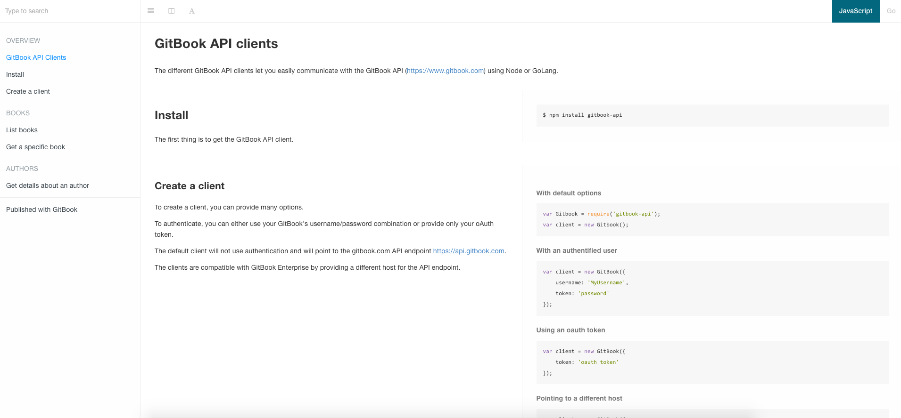

# GitBook API Theme

Theme for using GitBook to publish an API documentation. This theme works perfectly with search plugins (as the default one or algolia).



### Usage

This theme requires GitBook version 3 or later.

Add the theme to your book's configuration (book.json):

    {
        "plugins": ["theme-api"]
    }

### Defining methods

The theme allows to easily define methods with examples for different languages, using the templating blocks syntax.

A method block can contain any number of nested `sample` and `common` blocks.

Those nested blocks are documented below.

#### Sample blocks

    
    ## Install {#install}

    The first thing is to get the GitBook API client.

    
    ```bash
    $ npm install gitbook-api
    ```

    
    ```bash
    $ go get github.com/GitbookIO/go-gitbook-api
    ```
    


While the body of the method block will be used as the definition for your method, each `sample` will be used to display examples. To do so, each `sample` block should specify a language using the `lang` arguments.

This is great for managing examples in different languages, for instance when documenting different languages API clients at once.

On each page containing `method` blocks with samples, a switcher is automatically added at the top-right corner to easily select which language to display.

The name of each language can be configured in your `book.json` file, with it's `lang` property corresponding to the `sample` block `lang` argument:

    {
      "plugins": ["theme-api"],
      "pluginsConfig": {
        "theme-api": {
          "languages": [
            {
              "lang": "js",          // sample lang argument
              "name": "JavaScript",  // corresponding name to be displayed
              "default": true        // default language to show
            },
            {
              "lang": "go",
              "name": "Go"
            }
          ]
        }
      }
    }


If not provided, the name of the language will be the `lang` argument for a block uppercased.

Note that a `sample` block can contain any markdown content to be displayed for this language, not only code blocks, as illustrated below.


#### Common blocks

Common blocks are used to display content to be displayed for all languages in your examples.

    
    ## Simple method

    
    This text be displayed only for JavaScript.

    
    This text be displayed only for Go.

    
    This will be displayed for both JavaScript and Go.
    


### Layout

The theme provides two layouts to display your examples: one-column or two-columns (split).

###### One column layout


###### Split layout


The layout can be toggled from the toolbar using the layout icon: 

The default aspect can also be set in the theme configuration in the `book.json` file:

    {
      "pluginsConfig": {
        "theme-api": {
          "split": true
        }
      }
    }